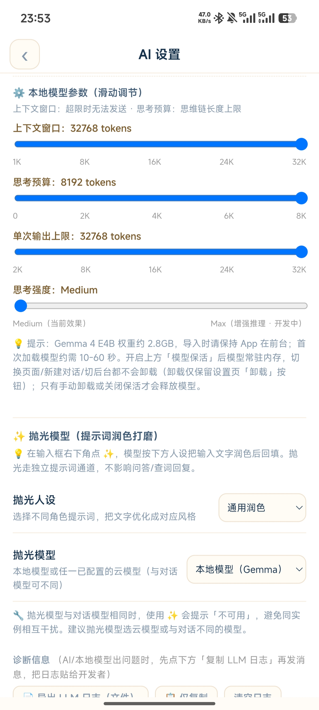
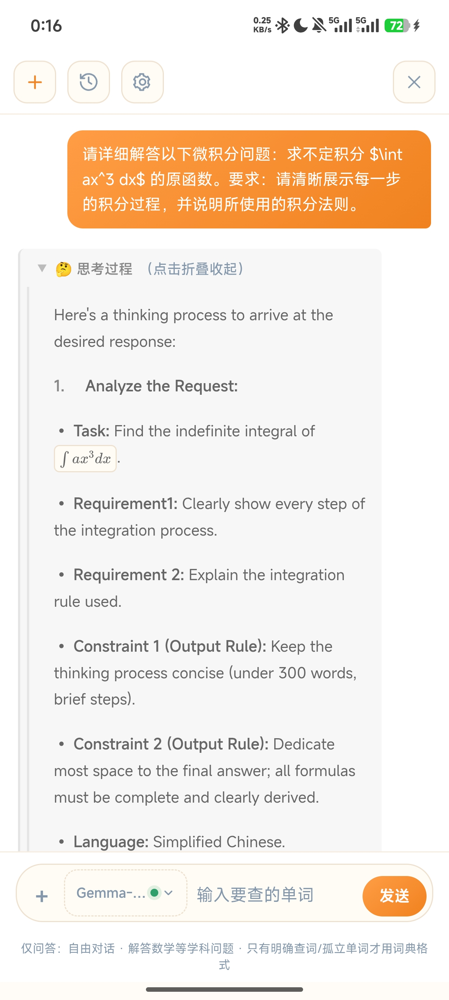
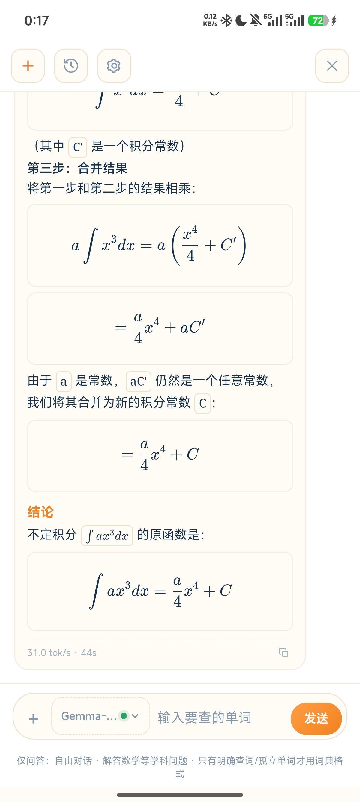
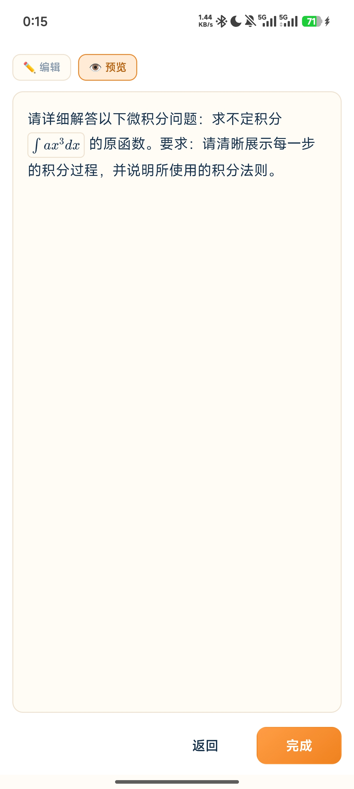
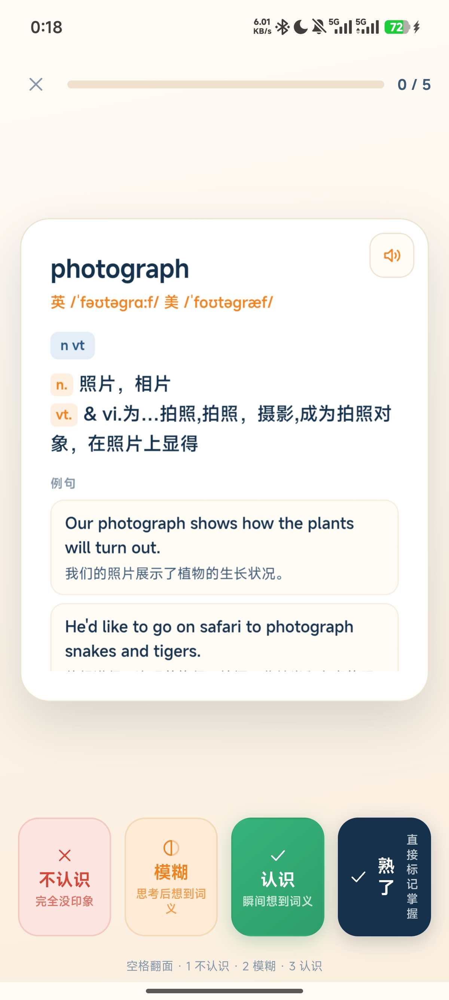
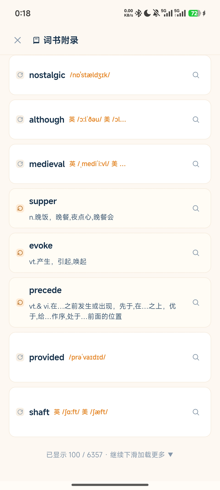
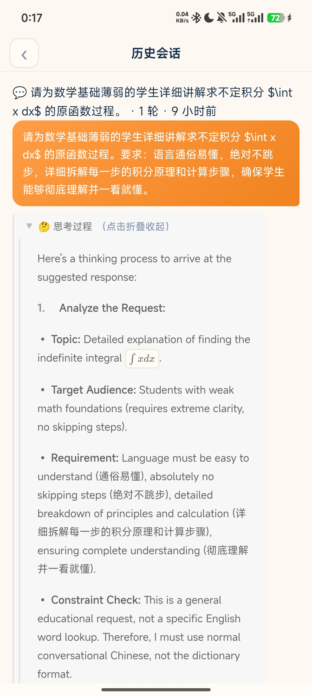
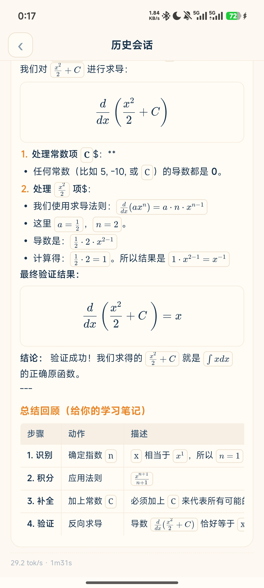

# Vocabulary APP（我爱背单词）

> 集**背单词 · AI 查词 · 本地大模型问答 · 完整账号体系 · 好友社交**于一体的 Android 学习 App。
> 单 Activity + 单 WebView + 单文件前端；后端为 Python FastAPI + SQLite，配套 Cloudflare Tunnel 一键公网。

当前版本：**v9.123**（详见 [CHANGELOG.md](./CHANGELOG.md)）

---

## ✨ 功能一览

### 📚 学习
- **多词书**：内置 6 本四级词书 + 1 本考研词书，支持导入 JSON / CSV / TXT 自定义词书
- **自适应间隔重复**：认识 → 间隔 × 难度系数推进；模糊 → 放回巩固；不认识 → 降级进生词本
- **今日任务**：新词 / 复习 / 错题 / 打卡联动，昨日未完成自动滚入今日
- **战绩**：已背 / 复习 / 到期统计 + 日历打卡 + 竖版战绩图导出 PNG

### 🤖 AI
- **AI 查词**：顶部下滑唤起查词面板（音标 / 词性 / 释义 / 例句 / 搭配）
- **本地大模型**：LiteRT-LM 离线推理（Gemma-4-E4B-it），完全离线、无需 API Key、前台服务保活
- **云端大模型**：DeepSeek / OpenAI 兼容接口，多模型同屏对比
- **深度思考**：思考通道、结构化 / 自由思考链 + KaTeX 数学渲染
- **提示词润色**：通用 / 代码 / 学术 / 商务 / 翻译 / 口语 6 种人设
- **历史会话**：持久化、左滑删除、跨会话记忆

### 🔐 账号与安全
- **完整认证**：注册 / 密码登录 / 短信登录 / 忘记密码 / 改密 / 换绑手机
- **安全存储**：Argon2id 密码哈希 + JWT 双 Token（Access 15min / Refresh 7d 旋转）
- **分层验证**：图形验证码（基础）+ 滑块拼图验证码（注册时二次验证，服务端校验缺口位置）
- **暴力防护**：登录连错 5 次锁 15 分钟；短信验证码 TTL / 冷却 / 失败次数限制
- **管理员系统**：隐藏入口 + 双因素认证；用户管理 / 封禁 / 版本发布
- **封禁机制**：时长 / 原因 / 自动解封 / 强制下线弹窗

### 👥 社交
- **好友**：按公开数字 ID 搜索、好友申请状态机、黑名单
- **私聊**：文字 + 文件 / 图片消息、已读状态、2 分钟内撤回、长按多选批量删除
- **实时消息**：WebSocket 长连接推送；自动重连 + 离线补同步；断网自动降级轮询
- **聊天背景**：每好友独立设置（≤10MB，超限自动压缩）
- **通知中心**：好友申请 / 新消息 / 文件通知，左滑删除、已读角标、系统通知栏
- **动态**：朋友圈式发布、可见性控制、点赞（取消）
- **个人主页**：头像 / 性别 / 签名，支持头像裁剪上传

### 🌐 公网访问
- **Cloudflare Tunnel 一键接入**：不买云服务器、不改业务，本地 FastAPI 映射公网
- 免费快速隧道（trycloudflare.com），HTTP + WebSocket 转发
- `/ws` 业务实时通道 + `/ws/echo` 连通性验证端点
- 公网地址 App 内单点配置（账户与安全 → 服务器地址），代码零硬编码
- 公网安全：调试接口一律 404；SQLite 与文件目录不暴露；鉴权 / 管理员双因素保留

---

## 🏗 技术架构

```
Android App（单 Activity + 单 WebView）
        │  assets/index.html（单文件前端，IIFE 封装，JS 全部内联）
        ▼
FastAPI（Python，server/）
   ├─ routers/  auth / friendship / message / file / notification / moments / admin
   ├─ db.py     SQLite（增量迁移 _SCHEMA）
   ├─ captcha.py / slider_captcha.py / sms.py / stores.py（KVStore 抽象，可换 Redis）
   └─ 静态托管 /app（浏览器直接访问客户端）
        ▼
SQLite（server/data/vocab_auth.db）
```

| 层 | 技术 |
|---|---|
| 前端 | 单文件 HTML/CSS/JS（IIFE），无框架依赖，KaTeX 渲染 |
| 后端 | FastAPI + uvicorn + Pydantic |
| 存储 | SQLite（内存 KVStore 抽象：验证码 / 冷却 / 一次性令牌） |
| 认证 | Argon2id + PyJWT（Access / Refresh 旋转） |
| 验证码 | PIL 程序化生成图形码 / 滑块拼图（缺口 x 仅存服务端，容差 8px） |
| 实时通信 | WebSocket（`/ws`），自动重连 + 离线补同步 |
| 公网 | Cloudflare Tunnel（cloudflared.exe） |

---

## 🚀 快速开始

### 1. 启动本地服务器

首次运行双击 `server/setup.bat`（创建虚拟环境 + 安装依赖），然后：

```powershell
cd server
.\.venv\Scripts\python run.py --host 0.0.0.0 --port 8000
```

- 首次启动自动创建 `server/data/vocab_auth.db`、生成管理员凭证与 JWT 密钥
- 浏览器访问 `http://127.0.0.1:8000/app` 直接使用客户端
- 完整依赖见 `server/requirements.txt`：fastapi / uvicorn / argon2-cffi / PyJWT / pillow / python-multipart

### 2. 构建 Android App

```powershell
.\gradlew.bat assembleDebug
# 产物：app\build\outputs\apk\debug\app-debug.apk
```

> 本机 Android SDK 默认路径 `C:\Users\wxh06\AppData\Local\Android\sdk`，如不同请设置 `ANDROID_HOME` 或在 `local.properties` 写入 `sdk.dir=...`（`local.properties` 已被 `.gitignore` 排除）。

### 3. 配置服务器地址（App 内）

打开 App → **我的 → 账户与安全 → 服务器地址**：

- 局域网：`http://电脑局域网IP:8000`
- 公网：见下方 Tunnel 章节

### 4. 公网访问（异地好友）

```powershell
# 首次：双击 server\tunnel\下载cloudflared.bat （下载客户端，约 60MB）
# 之后：python server\tunnel\start_tunnel.py
```

启动后等待 10~30 秒，控制台会打印公网地址 `https://xxx.trycloudflare.com`，把该地址填入 App「服务器地址」即可。详见 [`server/README_TUNNEL.md`](./server/README_TUNNEL.md)。

> ⚠️ 免费隧道每次启动地址会变；保持启动窗口开启即保持公网可达；电脑关机 / 关窗 = 异地不可访问（正常行为）。

---

## 📁 目录结构

```
CET4Prep-Android/
├── app/
│   └── src/main/
│       ├── assets/
│       │   ├── index.html              # 单文件前端（全部 UI + 逻辑 + IIFE）
│       │   ├── katex/                  # KaTeX 数学渲染（css + js + 字体）
│       │   ├── book1.json ~ book6.json # 内置词书
│       │   └── kaoyan.json
│       ├── java/com/example/cet4/
│       │   ├── MainActivity.java       # WebView + JS 桥（通知 / 下载 / 保活 / LLM）
│       │   ├── LocalLlm.kt             # LiteRT-LM 离线推理
│       │   ├── ModelKeepAliveService.java  # 本地 LLM 前台保活
│       │   ├── NotifyService.java      # 消息 / 通知系统通知栏服务
│       │   └── ReminderReceiver.java   # 每日提醒
│       └── res/                        # 图标 / 主题 / 字符串
│
├── server/
│   ├── main.py / run.py / config.py    # FastAPI 入口与配置
│   ├── db.py                           # SQLite 连接 + 增量迁移
│   ├── security.py                     # Argon2id + JWT
│   ├── captcha.py / slider_captcha.py  # 图形 / 滑块验证码
│   ├── sms.py                          # Mock 短信 Provider
│   ├── stores.py                       # 内存 KVStore 抽象
│   ├── social_util.py                  # 好友 / 聊天公共逻辑
│   ├── ws_hub.py                       # WebSocket 实时通道
│   ├── routers/                        # auth / friendship / message / file / notification / moments / admin
│   ├── tunnel/                         # cloudflared 启动脚本
│   ├── setup.bat                       # 一键创建虚拟环境 + 安装依赖
│   ├── requirements.txt
│   └── README_TUNNEL.md                # 公网 Tunnel 使用文档
│
├── screenshots/                        # 应用截图
├── gradle/                             # Gradle wrapper
├── build.gradle / settings.gradle
├── gradlew / gradlew.bat
├── .gitignore                          # 已排除构建 / 缓存 / 敏感数据
├── LICENSE                             # MIT
└── CHANGELOG.md                        # 版本历史
```

---

## 📸 应用截图

### AI 设置 — 本地模型参数与用量

| 模型参数（滑动调节） | Token 用量统计 |
| :---: | :---: |
|  |  |

### AI 对话 — 深度思考 / 数学渲染

<p align="center">
  
  &nbsp;&nbsp;
  
</p>

### 提示词润色 / 词典 / 词书

<p align="center">
  
  &nbsp;&nbsp;
  
  &nbsp;&nbsp;
  
</p>

### 历史会话

<p align="center">
  
  &nbsp;&nbsp;
  
</p>

---

## 🔒 安全设计

- **密码**：Argon2id 哈希存储，绝不存明文；改密后撤销全部 Refresh Token
- **JWT**：Access 15 分钟 / Refresh 7 天，刷新时旋转、登出撤销、设备绑定
- **图形验证码**：随机 4 字符（剔除易混淆字符）+ 干扰线 + 噪点，一次性 + 失败次数限制
- **滑块验证码**：服务端程序化生成背景图与缺口位置（**缺口 x 仅存服务端**），客户端视觉拖动提交，**容差 8px**；一次性、5 分钟 TTL、5 次失败作废；验证成功签发一次性滑块凭证供注册消费
- **短信验证码**：Mock Provider 随机 6 位（不引入万能码），TTL / 冷却 / 失败作废 / 一次性
- **管理员**：隐藏入口 + 双因素认证，管理接口均需鉴权，不因公网暴露而绕过
- **公网防护**：调试接口（短信 / 图形码明文 / 滑块缺口）经 Tunnel 一律 404；SQLite 与文件目录未挂载到 HTTP
- **输入校验**：Pydantic 模型 + 长度 / 格式 / 强度校验 + 统一错误文案（防账号枚举）

---

## 🤝 二次开发

| 想做的事 | 入口 |
|---|---|
| 改前端 UI / 交互 | `app/src/main/assets/index.html`（单文件，改完直接重打包 APK） |
| 加后端路由 | `server/routers/` 模仿现有文件加 `xxx.py`，再在 `main.py` 里 `include_router` |
| 换数据库 | `server/stores.py`（KVStore 抽象）+ `server/db.py`（SQL 拆出来） |
| 接 Redis | 实现 `stores.py` 同样的接口替换 |
| 自定义词书 | JSON / CSV / TXT 均可，App 内导入入口在词书列表 |
| 自托管（替代 Tunnel） | 把 `python run.py --host 0.0.0.0` 部署到有公网 IP 的机器即可，业务代码零改动 |

---

## 📄 License

[MIT](./LICENSE) © Vocabulary APP Contributors

---

## 🙏 致谢

- [FastAPI](https://fastapi.tiangolo.com/) / [uvicorn](https://www.uvicorn.org/)
- [Argon2](https://github.com/P-H-C/phc-winner-argon2) / [PyJWT](https://pyjwt.readthedocs.io/)
- [KaTeX](https://katex.org/)
- [LiteRT-LM](https://ai.google.dev/edge/litert) / Gemma
- [Cloudflare Tunnel](https://developers.cloudflare.com/cloudflare-one/connections/connect-networks/)

---

> ⚠️ `server/.admin_credentials.txt` / `server/.secret_key` / `server/data/`（SQLite + 上传文件）为运行时生成的敏感 / 用户数据，**已在 `.gitignore` 排除，不会进入仓库**。首次启动会自动生成管理员凭证与 JWT 密钥。
